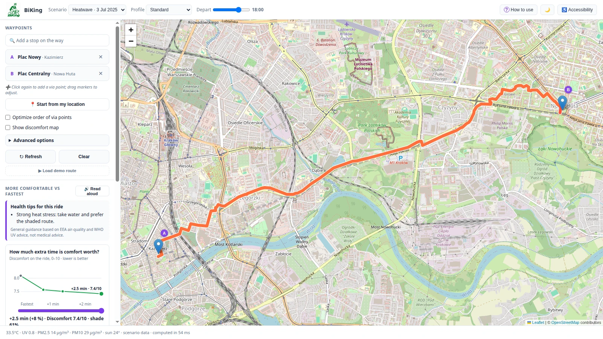
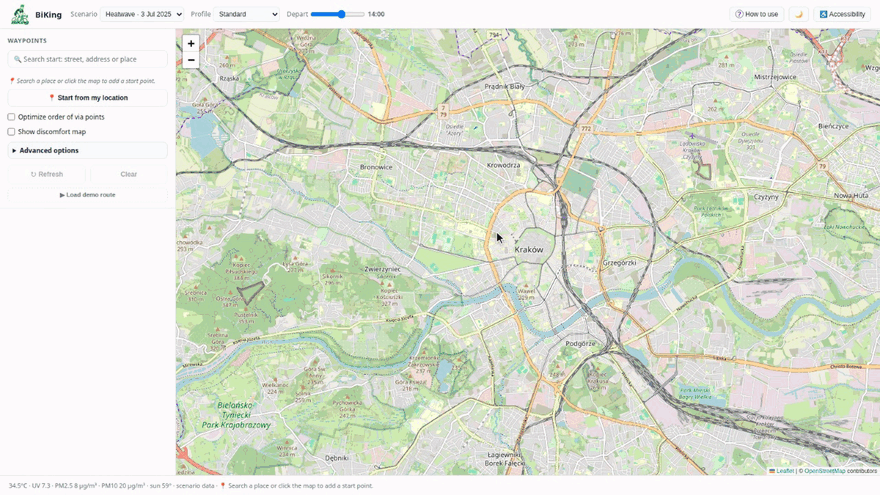
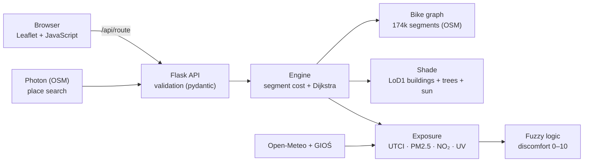

<div align="center">


# BiKing

**Cycle through Kraków the healthier way: in the shade, away from smog, heat and harsh sun.**

[](https://biking.karpinskisecurecloud.top)


[About](#-about) ·
[Try it online](#-try-it-online) ·
[Run it](#-run-it-from-scratch) ·
[How it works](#-how-it-works) ·
[Data](#-data) ·
[For developers](#-for-developers)

</div>

<picture>
  <source media="(prefers-color-scheme: dark)" srcset="docs/img/biking-dark.webp">
  
</picture>

## 🚲 About

On a hot day the fastest bike route often runs along sun-baked arterial roads, in full sun and traffic fumes.
For every street segment in Kraków, BiKing works out how unpleasant it is to ride there: the felt temperature
with the shade of buildings and trees, the air quality and the UV radiation. It then shows the **fastest route**
and a **more comfortable route** side by side and says plainly how many minutes the extra shade or cleaner air
costs.

- 🔎 **Place search** by name and address; points clicked on the map get a street name
- 🧭 **Up to 5 points** per route, with an option to put the stops in the best order
- 🌡️ **Scenarios**: live data, the 3 July 2025 heatwave and the 20 January 2025 smog episode, with a departure time
- 🧑‍🦳 **Profiles**: standard, asthma & allergy, senior & child, athlete (asthma puts clean air before shade)
- ⚖️ **"How much extra time is comfort worth?" slider** with a time vs discomfort trade-off chart
- 🗺️ **Discomfort map** of the streets, health tips for the ride, and reading them aloud
- ⬇️ **GPX export** for Komoot, Garmin Connect and Strava
- ♿ **Accessibility**: colour-blind palettes, larger text, high contrast, reduced motion, dark mode, full keyboard
  and screen-reader support
- ❓ **Built-in tutorial** (the *How to use* button)

## 🌐 Try it online

### ➡️ **[biking.karpinskisecurecloud.top](https://biking.karpinskisecurecloud.top)**

<p align="center">
  
  <br>
  <sub>The demo route, a later departure, the <i>How much extra time is comfort worth?</i> slider and dark mode.</sub>
</p>

Nothing to install. A good way to start:

1. Click **▶ Load demo route**: a ride from Plac Nowy in Kazimierz to Plac Centralny in Nowa Huta during the heatwave.
2. Compare the fastest route (dashed) with the more comfortable one (coloured by discomfort) and the result cards.
3. Move the **How much extra time is comfort worth?** slider and watch the route change.
4. Switch **Profile** to *Asthma / Allergy*, or **Scenario** to *Smog*.

The **? How to use** button in the top-right corner opens a short tutorial.

## 🚀 Run it from scratch

The repository already contains the processed data for the whole city (`data/processed/`), so the app runs on real
data straight after cloning. No data pipeline needs to be run.

| You need | Notes |
|---|---|
| [Git](https://git-scm.com/downloads) | to clone the repository (~150 MB including the data) |
| [Python 3.12 or newer](https://www.python.org/downloads/) | or just [Docker](https://docs.docker.com/get-docker/), see below |
| ~1 GB of disk space and ~1 GB of RAM | the app keeps the street graph and shade in memory (~450 MB) |
| an internet connection | for the map tiles, live data and place search |

Pick your system:

<details open>
<summary><b>🐧 Linux &nbsp;/&nbsp; 🍎 macOS</b></summary>

<br>

```bash
git clone https://github.com/karabowiczjakub/larpathon.git
cd larpathon

python3 -m venv .venv                                    # an environment just for this project
.venv/bin/python -m pip install -r requirements-app.txt  # ~1 min

./run_frontend_demo.sh
```

Open **http://127.0.0.1:8000**. Stop it with `Ctrl+C`.

- Ubuntu/Debian: if `python3 -m venv` fails, install it with `sudo apt install python3-venv`.
- macOS: get Python from [python.org](https://www.python.org/downloads/) or run `brew install python@3.13`.
- Another port: `PORT=8001 ./run_frontend_demo.sh`.

</details>

<details>
<summary><b>🪟 Windows</b></summary>

<br>

Install Python from [python.org](https://www.python.org/downloads/) (tick *Add python.exe to PATH*), then in
PowerShell or the Command Prompt:

```powershell
git clone https://github.com/karabowiczjakub/larpathon.git
cd larpathon

py -m venv .venv
.venv\Scripts\python -m pip install -r requirements-app.txt

.\run_frontend_demo.bat
```

Open **http://127.0.0.1:8000**. Stop it with `Ctrl+C`. There is no need to activate the environment: the script
uses the Python in `.venv` by itself.

</details>

<details>
<summary><b>🐳 Docker</b> (no Python install needed)</summary>

<br>

```bash
git clone https://github.com/karabowiczjakub/larpathon.git
cd larpathon

docker compose up -d --build app   # first build ~2 min, start ~15 s
```

Open **http://127.0.0.1:8000**.

```bash
docker compose ps          # the app should be "healthy"
docker compose logs -f app # logs
docker compose down        # stop
```

</details>

<details>
<summary><b>🧪 Without data</b> (mock mode, for frontend work)</summary>

<br>

Instead of the real city data, the app uses a synthetic street grid over Kraków. Only useful when working on the
frontend.

Linux / macOS:

```bash
USE_MOCKS=1 ./run_frontend_demo.sh
```

Windows (Command Prompt):

```bat
set USE_MOCKS=1
.\run_frontend_demo.bat
```

</details>

### ✅ Check that it works

Open **http://127.0.0.1:8000/api/health**. All four modules should say `"real"`:

```json
{"ok": true, "mocks": false, "modules": {"graph": "real", "shade": "real", "env": "real", "exposure": "real"},
 "edges": 174039, "live_source": "live", ...}
```

<details>
<summary><b>🛠️ Something is wrong?</b></summary>

<br>

| Symptom | What to do |
|---|---|
| `Address already in use` | port 8000 is taken: `PORT=8001 ./run_frontend_demo.sh`, or `PORT=8001` for Docker |
| a module shows `"mock (fallback)"` in `/api/health` | data is missing from `data/processed/`; the `errors` field says exactly what |
| `No matching distribution found` while installing | your Python is too old; 3.12 or newer is needed |
| *Place search is unavailable right now* | no internet connection; you can still click points on the map |
| `live_source: "fallback"` | the live data services do not answer; the recorded scenarios always work |

</details>

### 🌍 Deploying under your own domain

The online version runs in Docker behind a [Cloudflare Tunnel](https://developers.cloudflare.com/cloudflare-one/connections/connect-networks/):
the server opens no ports and Cloudflare provides HTTPS. All it needs is the tunnel token in `.env`:

```bash
echo "TUNNEL_TOKEN=<token from Cloudflare Zero Trust>" > .env
docker compose --profile tunnel up -d --build
```

Step by step: [`app/README.md` → Deploy](app/README.md#deploy-docker--cloudflare-tunnel).

## 🧠 How it works



1. **Shade.** For the sun's position at the given time (pvlib), we compute how much of each street segment lies in
   the shade of buildings (LoD1 models) and tree crowns.
2. **Felt temperature.** UTCI (pythermalcomfort) from temperature, humidity, wind and radiation, adjusted for shade,
   cooling under trees and the local heat island seen in Landsat satellite images.
3. **Air and UV.** PM2.5, PM10 and NO₂ from GIOŚ stations and Open-Meteo, with more NO₂ along busy roads; the UV
   index is reduced by shade.
4. **Discomfort.** A Mamdani fuzzy model (11 rules, tuned per profile) combines heat, air and UV into a single
   0–10 score.
5. **Route.** A segment costs `time × (1 + α · excess discomfort)`. Dijkstra finds the fastest and the more
   comfortable route, and the slider shows a Pareto front: further routes, each of which buys clearly less
   discomfort for a bit more time (at most +30%).

A route takes ~50–300 ms to compute. On 50 random 1.5–6 km rides during the heatwave, the more comfortable route is
typically (median) **6% longer** and has **17.5 percentage points more shade**. Details and full results:
[`app/README.md`](app/README.md#eco-cost-and-benchmark-real-graph-3-oct-2026).

## 📊 Data

| Source | Used for |
|---|---|
| [OpenStreetMap](https://www.openstreetmap.org/) (osmnx) | the street and cycle-path graph, map tiles |
| [GUGiK](https://www.geoportal.gov.pl/) LoD1 3D building models (2024), completed from OSM | building heights → shade |
| [MSIP Kraków](https://msip.krakow.pl/) green map (2015), completed from OSM | tree crowns → shade and cooling |
| Landsat 8/9 via [Microsoft Planetary Computer](https://planetarycomputer.microsoft.com/) | summer surface temperature of the streets |
| [GIOŚ](https://powietrze.gios.gov.pl/) | PM2.5, PM10 and NO₂ measured at Kraków stations |
| [Open-Meteo](https://open-meteo.com/) | weather, radiation, UV and air-quality forecast; archive for the scenarios |
| [Photon](https://photon.komoot.io/) (komoot) | place and address search |

The health tips follow EEA (air quality) and WHO (UV) guidance and are not medical advice.

## 👩‍💻 For developers

```bash
.venv/bin/python -m pip install -r requirements.txt   # the full environment: tests and the data pipeline

make dev     # Flask dev server with reload
make mock    # the whole app on mocks
make test    # pytest
make bench   # 50 random routes: response times and route comparison
```

| Directory | Contents |
|---|---|
| [`app/`](app/) | Flask backend and the frontend (`app/static/`); API and plugging in modules: [`app/README.md`](app/README.md) |
| [`pipeline/`](pipeline/) | building the data: graph, shade, heat map, scenarios, fuzzy lookup tables |
| [`data/processed/`](data/processed/) | the processed data the app reads |
| [`scenarios/`](scenarios/) | recorded days: heatwave and smog |
| [`tests/`](tests/) | tests (pytest) |
| [`roles/`](roles/) | how the team split the work, and the contracts between modules |
| [`docs/`](docs/) | notes on the shade and environment models |
| [`presentation/`](presentation/) | the HackYeah presentation |

`requirements-app.txt` holds only what the app needs to run (Docker uses it); `requirements.txt` adds the tools for
testing and building the data.

---

<div align="center">

Built at **HackYeah 2026** in Kraków · map data © [OpenStreetMap contributors](https://www.openstreetmap.org/copyright)

</div>
